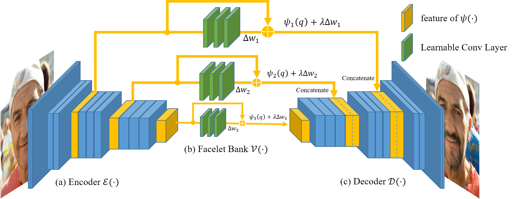

# Facelet-Bank for Fast Portrait Manipulation



## Prerequisites

- Python 2.7 or Python 3.6
- NVIDIA GPU or CPU (only for testing)
- Linux or MacOS

## Getting Started

### Installation

Install pytorch. The code is tested on 0.3.1 version. 
```bash
pip install http://download.pytorch.org/whl/cu90/torch-0.3.1-cp27-cp27mu-linux_x86_64.whl
```

Clone this project to your machine. 

```bash
git clone https://github.com/yingcong/Facelet_Bank.git
cd Facelet_Bank
```

Run 

```bash
pip install -r requirements.txt
```

to install other packages.

### How to use

We support testing on images and videos. 

To test an image:

```bash
python test_facelet_net.py test_image --input_path examples/input.png --effect facehair --strength 5
```

If "--input_path" is a folder, all images in this folder will be tested.

To test a video:

```bash
python test_facelet_net.py test_video --input_path examples/input.mp4 --effect facehair --strength 5
```

Note that all required models will be downloaded automatically for the first time. Alternatively, you can also manually download the **facelet_bank** folder from [dropbox](https://www.dropbox.com/sh/zlx22zgunfl0ueh/AACwoywXOFqSzMnasFGFwjkDa?dl=0) or [Baidu Netdisk](https://pan.baidu.com/s/1ec7hVQSnhqbpNg9f93jxzw) and put them in the root directory. 

If you do not have a GPU, please include "-cpu" argument to your command. For speed issue, you can optionally use a smaller image by specifying the "--size " option. 

```bash
python test_facelet_net.py test_image --input_path examples/input.png --effect facehair --strength 5 --size 400,300 -cpu
```

For more details, please run

```bash
python test_facelet_net.py test_image --help
```

or

```bash
python test_facelet_net.py test_video --help
```

**Note:**  Although this framework is robust to an extent, testing on extreme cases could cause the degradation of quality. For example, an extremely high strength may cause artifact. Testing on an extremely large image may not work as well as testing on a proper size (from 448 x 448 to 600 x 800).

## More effects

The current project supports 

- facehair
- older
- younger
- feminization
- masculinization

More effects will be available in the future. Once a new effect is released, the **global_vars.py** file will be updated accordingly. We also provide an instruction of training your own effect in the following.

## Results


## Training

Training our network requires two steps, i.e.,  generating the attribute vector (Eq. (6) in our paper) and training our model. 

### Generating attribute vector

We utilize the [Deep Feature Interpolation](https://github.com/paulu/deepfeatinterp) project to generate attribute vectors as pseudo labels to supervise our facelet network. Please see <https://github.com/paulu/deepfeatinterp> for more details. 

After setting up the DFI project, copy **DFI/demo2_facelet.py**  to its root directory. Then cd to the DFI project folder and run 

```bash
python demo2_facelet.py --effect facehair --input_path images/celeba --npz_path attribute_vector
```

This extracts the *facehair* effect from *images/celeba* folder, and save the extracted attribute vectors to *attribute_vector* folder. For more details, please run

```
python demo2_facelet.py --help
```

**Note:** In our implementation, we use the aligned version of [celebA](http://mmlab.ie.cuhk.edu.hk/projects/CelebA.html) dataset for training, and resize the images to 448 x 448. 

From our experience, 2000~3000 samples should be enough to train a facelet model.

### Training Facelet model

After generating enough attribute vectors, we can utilize them to train a facelet model. Please cd to the **Facelet_bank** folder and run 

```bash
python train_facelet_net.py --effect facehair --input_path ../deepfeatinterp/images/celeba --npz_path ../deepfeatinterp/attribute_vector
```

where "--input_path" is the training image folder (the one used for generating attribute vector), and "--npz_path" is the folder of the generated attribute vectors. 

For more details, please run

```bash
python train_facelet_net.py --help
```

### Testing your own model

The trained facelet model is stored in the **checkpoint** folder. To test the trained model, please include the "--local_model" augment, i.e., 

```bash
python test_facelet_net.py test_image --input_path examples/input.png --effect facehair --strength 5 --local_model
```

## Reference

[Ying-Cong Chen](http://www.cse.cuhk.edu.hk/~ycchen), Huaijia Lin, Michelle Shu,  Ruiyu Li, [Xin Tao](http://www.xtao.website), Yangang Ye, [Xiaoyong Shen](http://xiaoyongshen.me), [Jiaya Jia](http://www.cse.cuhk.edu.hk/leojia), "Facelet-Bank for Fast Portrait Manipulation" ,* Computer Vision and Pattern Recognition (CVPR), 2018 [pdf](https://arxiv.org/abs/1803.05576) 

```bibtex
@inproceedings{Chen2018Facelet,
  title={Facelet-Bank for Fast Portrait Manipulation},
  author={Chen, Ying-Cong and Lin, Huaijia and Shu, Michelle and Li, Ruiyu and Tao, Xin and Ye, Yangang and Shen, Xiaoyong and Jia, Jiaya},
  booktitle={CVPR},
  year={2018}
}
```

## Contact

Please contact <yingcong.ian.chen@gmail.com> if you have any question or suggestion. 
